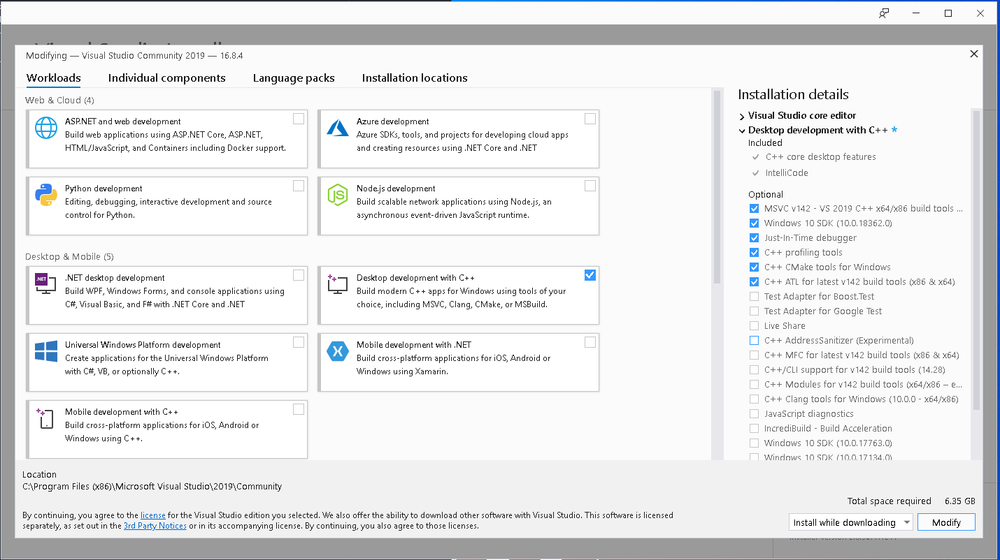
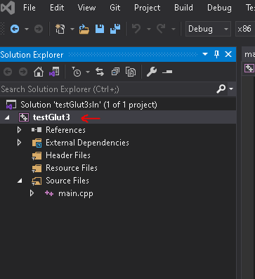
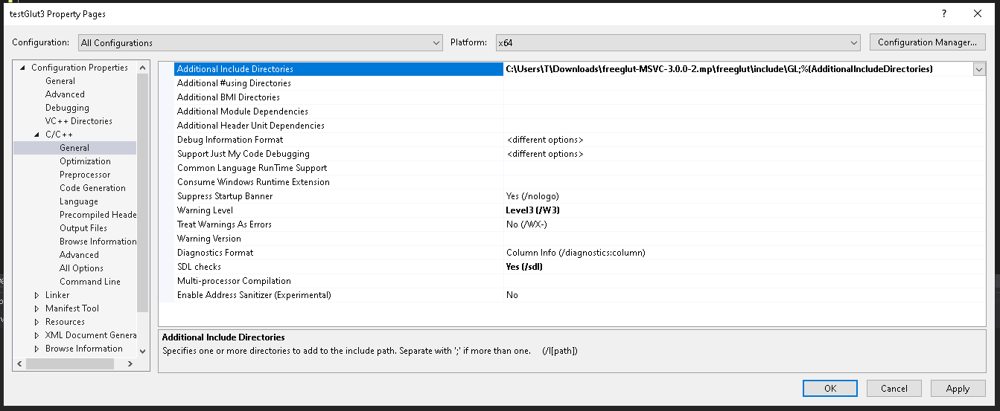
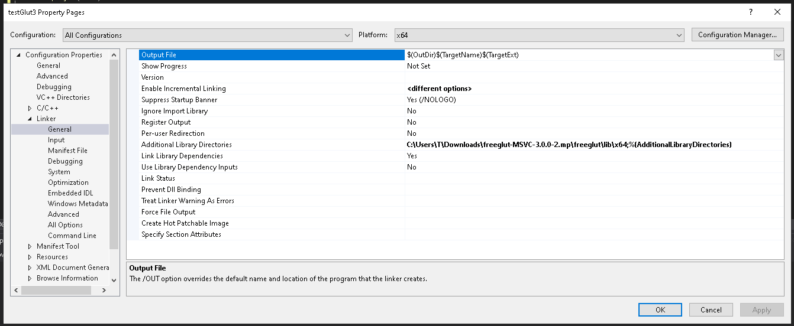
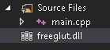
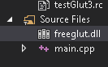

## Walkthrough for working with Glut and OpenGL on Windows 10

### Sanity check:
Before getting started, here are some items to look at:
* Latest drivers for your machine installed?
    * If you have integrated graphics (i5 or related CPU's, some AMD models) double check that they are up to date
* Blender installed? Best check to see if OpenGL is working, open Blender
    * OpenGL DOES NOT WORK over RDP. If Blender opens, you are set.
    * If you use a computer remotely, you will need to use some crazy work arounds.
    * NoMachine, Parsec, worse options would be VNC or TeamViewer

1. Install Visual Studio 2019 (at least 2017 if you already have it)
    * Want to explore Windows automation? Try using [Chocolatey](https://chocolatey.org/install) `choco install -y visualstudio-community`
    * Otherwise, go [here](https://visualstudio.microsoft.com/downloads/) and download the community package (you can upgrade to Pro later).
    * Once it's installed, you'll need to check these boxes:
    
    * Just the C++, you can install others, but its HUGE, and will get confusing when choosing a project type.

2. Download Glut
    This Writeup will use FreeGLUT, an open source project that keeps GLUT up to date
    * Downloaded THE COMPILED VERSION [here](https://www.transmissionzero.co.uk/software/freeglut-devel/).
    * Click the "MSVC" Download.
    * You could download the source code and compile yourself, but this is simpler (someone else compiled it and uploaded the binaries).
    * Remember where you download and extract it to; I simply unzipped it in the Downloads folder.


3. Create a Project
    1. At the VisualStudio main screen, click "Create new project"
        * Project Type: "Windows Console Application"
        * Select the defaults, and then click Create

    2. There will not be any files, so you will need to create one (main.cpp)
        * locate the "Solution Explorer" window
        * right click "Source Files" -> Add -> New Item; select C++ File, and give it a name at the bottom of that window.
        * Sample code to paste into the new file you created:

```c++
#include <Windows.h>
#include <gl/GL.h>
#include <gl/GLU.h>
#include <iostream>
#include <freeglut.h>


void displayMe(void)
{
    glClear(GL_COLOR_BUFFER_BIT);
    glBegin(GL_POLYGON);
    glVertex3f(0.5, 0.0, 0.5);
    glVertex3f(0.5, 0.0, 0.0);
    glVertex3f(0.0, 0.5, 0.0);
    glVertex3f(0.0, 0.0, 0.5);
    glEnd();
    glFlush();
}

int main(int argc, char** argv)
{
    glutInit(&argc, argv);
    glutInitDisplayMode(GLUT_SINGLE);
    glutInitWindowSize(400, 300);
    glutInitWindowPosition(100, 100);
    glutCreateWindow("Hello world!");
    glutDisplayFunc(displayMe);
    glutMainLoop();
    return 0;
}
```

4. Fix CLASSPATH/Dependency errors

* You will notice that the glut references are erroring. Let's fix that.

* **This setup process could be easier by copying the FreeGLUT files to the respected directories, but this is also harder to undo or change when another update for FreeGLUT comes. This setup means that this configuration is SLN specific - to copy this configuration for future projects, copy this project folder (When complete) and use it as a base for future projects.**

    1. In "Solution Explorer", highlight the project file (Not the SLN file):
        * 

    2. Right click that and click properties

    3. Ensure that the top selections show "All Configurations" and "Win32" (it might say "Active(Win32) if your VisualStudio window has x86 selected at the top"). FYI, VisualStudio will directly compile your code to the architecture you select; x86 compiles a 32bit application and x64 compiles to 64bit. We are about to configure this Soultion (SLN) to use the 32bit resources for the 32bit exe, and the 64bit resources when compiling the 64bit exe.

    4. Under "C/C++" dropdown:
        * Click General
        * Click "Additional Include Directories"
        * Add (edit) `<where you downloaded & extracted FreeGlut>\freeglut\include\GL`. Click OK and then Apply.
        * Change the Platform (at the top of the properties window) to x64, and repeat.
        * Now, the `#include <freeglut.h>` line in your file should no longer show the red squiggly underneath.
        * It should look something similar to this (for both Win32 and x64)
        

    5. Under "Linker" on the left side menu (*AS win32 PLATFORM SELECTED*):
        * Click "Additional Library Directories" the box -> Edit -> and add `<freeglut download folder>\freeglut\lib\`. Click OK and then Apply.
        * Change the Platform (at the top of the properties window) to x64, and repeat, EXCEPT go into the x64 folder this time.
        * It should look something like this for x64:
        
        * Close the properties window.

    6. Finally, add the dll's to the project:
        * Open up File explorer, and go to the FreeGLUT download folder, and go to `freeglut\bin`
        * Drag that file into the VisualStudio Window, right on top of your project file. The arrow points to that file:
        
        * It will look like this:
        
        * It should NOT look like this:
        
        * Select that dll, right click, and select Properties.
        * Change Platform at the top of this window to Win32! Change "Exclude From Build" to No, AND "Content" to Yes. Click Apply.
        * While on this file, Change the platform to x64. Change "Excluded From Build" to Yes. This hides the 32bit dll from the 64bit configuration.
        * Close the Properties window, and at the top of the VisualStudio screen, next to the "Debug" or Play button dropdown, change the build to x64. There should be a disabled icon on that dll.

    7. One last time...
        * Go to `<freeglut download folder>\freeglut\bin\x64`, and drag this DIFFERENT dll file over the project file like you did before for the above instructions.
        * Highlight it, then right click, and select properties.
        * At the top of this properties windpw, select platform "Win32". Change "Excluded From Build" to Yes. Click Apply.
        * Change the platform back to x64. Change "Excluded From Build" to No, AND "Content" to Yes. Click apply.

5. Test it out
        * When you change between x64 and x86 at the top, the two different DLL's should toggle, one will always be disabled, and the other will be enabled
        * Run the test code on x86, and again with x64 selected. Both should show a triangle in the screen.


## Miscellaneous
Some of these links were helpful, but some wanted to install GLEW or use bad strategies to get the CLASSPATH items configured.
https://www.quora.com/How-do-I-include-header-files-in-visual-C++-to-a-given-source-file
https://www.absingh.com/opengl/
http://www.codebind.com/linux-tutorials/install-opengl-ubuntu-linux/

* There might be fewer items needed to select during the install of VisualStudio, which would make it easier on hard drive space.

* It is also okay to copy the FreeGLUT items into your project, it is just complicated to explain how to do that outside of VisualStudio

* *I also have this working on Ubuntu in VSCode. Reach out if you would like that tutorial too!*
